# Rail graph

Walked from the live engine. Nodes are chair + card + face + ending. Bars and
clocks do not fork the graph. Two live buttons that land on the same next card
are a collapse.

The huge terminal counts are binary trees counting the same shared destinations
over and over. The unique graph is small.

| Chair | Unique nodes | Edges | Terminal path counts |
| --- | --- | --- | --- |
| US | 15 | 25 | 2049 |
| Iran | 22 | 32 | 3846 |

Collapses: 20 live (playing to the same next card).
US also has a terminal collapse on the cup: both buttons are Rail hold.

Unwired playable from 1953: hormuz-2019

Spine still waiting (not a collapse, just not written): natanz-2002, green-2009, stuxnet-2010, jcpoa-2015, white-wednesdays-2017, archive-2018, soleimani-2020, mahsa-2022, poisonings-2022, oct7-2023, direct-fire-2024

1938 is a year-click egg. Hormuz 2019 is an isolation start. Neither is in this walk.

Purple boxes collapse. Teal boxes actually fork. Red hexes are graves. Green
stadiums are Rail hold.

Solid arrows are golden-path or number-tweak continues. Dotted arrows are AL.

## US at a glance

Year and face only. Full titles in the next diagram.

```mermaid
flowchart TB
  classDef play fill:#1c2333,stroke:#c4a35a,color:#f3ead8
  classDef grave fill:#3a1a1a,stroke:#c45c5c,color:#f3ead8
  classDef hold fill:#1a2e22,stroke:#5d9b6a,color:#f3ead8
  classDef collapse fill:#2a2433,stroke:#8a7bb8,color:#f3ead8
  classDef fork fill:#23333a,stroke:#6ab4c8,color:#f3ead8
  us_coup_1953_us_playing_live_us_back_shah_us_walk["1953 ike"]:::fork
  us_atoms_1957_us_playing_live_us_keep_fuel_us_let_enrich["1957 ike"]:::collapse
  us_coup_1953_us_ended_satrap_1953_{{"1953 satrap_1953"}}:::grave
  us_white_revolution_1963_us_playing_live_us_press_reform_us_send_tanks["1963 kennedy"]:::collapse
  us_weapons_1972_us_playing_live_us_blank_check_us_hinterland_first["1972 nixon"]:::collapse
  us_revolution_1979_us_playing_live_us_admit_shah_us_keep_shah_out["1978–1979 carter"]:::collapse
  us_veil_1979_us_playing_live_us_statement_women_us_stay_out["March 1979 carter"]:::collapse
  us_hostages_1979_us_playing_live_us_eagle_claw_us_keep_talking["November 1979 carter"]:::collapse
  us_iran_iraq_1980_us_playing_live_us_no_tilt_us_tilt_iraq["September 1980 carter"]:::collapse
  us_election_1980_us_playing_live_us_hail_mary_us_run_again["November 1980 carter"]:::collapse
  us_inaugurated_1981_us_playing_live_us_sit_reagan["January 1981 reagan"]:::play
  us_lebanon_1983_us_playing_live_us_bring_home_us_hit_bekaa["1982–1983 reagan"]:::collapse
  us_iran_contra_1985_us_playing_live_us_keep_embargo_us_sell_missiles["1985–1987 reagan"]:::collapse
  us_cup_1988_us_playing_live_us_call_mistake_us_own_shot["1988 reagan"]:::collapse
  us_cup_1988_us_ended_none_(["1988 Rail hold"]):::hold
  us_coup_1953_us_playing_live_us_back_shah_us_walk -->|"H Back the Shah (covert)"| us_atoms_1957_us_playing_live_us_keep_fuel_us_let_enrich
  us_coup_1953_us_playing_live_us_back_shah_us_walk -.->|"AL Walk away"| us_coup_1953_us_ended_satrap_1953_
  us_atoms_1957_us_playing_live_us_keep_fuel_us_let_enrich -->|"H Keep sending the fuel"| us_white_revolution_1963_us_playing_live_us_press_reform_us_send_tanks
  us_atoms_1957_us_playing_live_us_keep_fuel_us_let_enrich -->|"Let them run the fuel cycle"| us_white_revolution_1963_us_playing_live_us_press_reform_us_send_tanks
  us_white_revolution_1963_us_playing_live_us_press_reform_us_send_tanks -->|"H Press him to reform"| us_weapons_1972_us_playing_live_us_blank_check_us_hinterland_first
  us_white_revolution_1963_us_playing_live_us_press_reform_us_send_tanks -->|"Send him tanks instead"| us_weapons_1972_us_playing_live_us_blank_check_us_hinterland_first
  us_weapons_1972_us_playing_live_us_blank_check_us_hinterland_first -->|"H Sign the blank check"| us_revolution_1979_us_playing_live_us_admit_shah_us_keep_shah_out
  us_weapons_1972_us_playing_live_us_blank_check_us_hinterland_first -->|"Make him spend on the hinterland first"| us_revolution_1979_us_playing_live_us_admit_shah_us_keep_shah_out
  us_revolution_1979_us_playing_live_us_admit_shah_us_keep_shah_out -->|"H Let him in for treatment"| us_veil_1979_us_playing_live_us_statement_women_us_stay_out
  us_revolution_1979_us_playing_live_us_admit_shah_us_keep_shah_out -.->|"AL Keep him out"| us_veil_1979_us_playing_live_us_statement_women_us_stay_out
  us_veil_1979_us_playing_live_us_statement_women_us_stay_out -->|"Issue a statement"| us_hostages_1979_us_playing_live_us_eagle_claw_us_keep_talking
  us_veil_1979_us_playing_live_us_statement_women_us_stay_out -->|"H Stay out"| us_hostages_1979_us_playing_live_us_eagle_claw_us_keep_talking
  us_hostages_1979_us_playing_live_us_eagle_claw_us_keep_talking -->|"H Authorize a rescue"| us_iran_iraq_1980_us_playing_live_us_no_tilt_us_tilt_iraq
  us_hostages_1979_us_playing_live_us_eagle_claw_us_keep_talking -.->|"AL Keep talking"| us_iran_iraq_1980_us_playing_live_us_no_tilt_us_tilt_iraq
  us_iran_iraq_1980_us_playing_live_us_no_tilt_us_tilt_iraq -->|"H Tilt to Iraq"| us_election_1980_us_playing_live_us_hail_mary_us_run_again
  us_iran_iraq_1980_us_playing_live_us_no_tilt_us_tilt_iraq -.->|"AL Stay out of the war"| us_election_1980_us_playing_live_us_hail_mary_us_run_again
  us_election_1980_us_playing_live_us_hail_mary_us_run_again -->|"H Run again"| us_inaugurated_1981_us_playing_live_us_sit_reagan
  us_election_1980_us_playing_live_us_hail_mary_us_run_again -.->|"AL Throw a Hail Mary"| us_inaugurated_1981_us_playing_live_us_sit_reagan
  us_inaugurated_1981_us_playing_live_us_sit_reagan -->|"H Sit the presidency"| us_lebanon_1983_us_playing_live_us_bring_home_us_hit_bekaa
  us_lebanon_1983_us_playing_live_us_bring_home_us_hit_bekaa -->|"H Bring them home"| us_iran_contra_1985_us_playing_live_us_keep_embargo_us_sell_missiles
  us_lebanon_1983_us_playing_live_us_bring_home_us_hit_bekaa -.->|"AL Stay and hit the Bekaa"| us_iran_contra_1985_us_playing_live_us_keep_embargo_us_sell_missiles
  us_iran_contra_1985_us_playing_live_us_keep_embargo_us_sell_missiles -->|"H Sell them the missiles"| us_cup_1988_us_playing_live_us_call_mistake_us_own_shot
  us_iran_contra_1985_us_playing_live_us_keep_embargo_us_sell_missiles -.->|"AL Keep the embargo"| us_cup_1988_us_playing_live_us_call_mistake_us_own_shot
  us_cup_1988_us_playing_live_us_call_mistake_us_own_shot -->|"H Call it a mistake"| us_cup_1988_us_ended_none_
  us_cup_1988_us_playing_live_us_call_mistake_us_own_shot -.->|"AL Own the shot"| us_cup_1988_us_ended_none_
```

## Iran at a glance

Mossadegh can keep the chair by dealing with London. That costume runs through
Nixon, then 1979 still seats Bazargan.

```mermaid
flowchart TB
  classDef play fill:#1c2333,stroke:#c4a35a,color:#f3ead8
  classDef grave fill:#3a1a1a,stroke:#c45c5c,color:#f3ead8
  classDef hold fill:#1a2e22,stroke:#5d9b6a,color:#f3ead8
  classDef collapse fill:#2a2433,stroke:#8a7bb8,color:#f3ead8
  classDef fork fill:#23333a,stroke:#6ab4c8,color:#f3ead8
  iran_coup_1953_mossadegh_playing_live_ir_deal_london_ir_deal_moscow_ir_nationalize["1953 mossadegh"]:::fork
  iran_deposed_1953_shah_playing_live_ir_sit_throne["1953 shah"]:::play
  iran_coup_1953_mossadegh_ended_mossadegh_street_{{"1953 mossadegh_street"}}:::grave
  iran_coup_1953_mossadegh_ended_mossadegh_falls_{{"1953 mossadegh_falls"}}:::grave
  iran_atoms_1957_shah_playing_live_ir_shah_fuel_ir_shah_plant["1957 shah"]:::collapse
  iran_white_revolution_1963_shah_playing_live_ir_keep_quiet_ir_white_rev["1963 shah"]:::collapse
  iran_weapons_1972_shah_playing_live_ir_buy_catalog_ir_spend_villages["1972 shah"]:::fork
  iran_revolution_1979_shah_playing_live_ir_fire_crowd_ir_shah_leave["1978–1979 shah"]:::collapse
  iran_revolution_1979_shah_playing_live_ir_shah_hold_ir_shah_leave["1978–1979 shah"]:::fork
  iran_veil_1979_bazargan_playing_live_ir_keep_fpl_ir_repeal_fpl["March 1979 bazargan"]:::collapse
  iran_revolution_1979_shah_ended_shah_holds_{{"1978–1979 shah_holds"}}:::grave
  iran_hostages_1979_bazargan_playing_live_ir_demand_leave_ir_let_students["November 1979 bazargan"]:::collapse
  iran_resigned_1979_banisadr_playing_live_ir_refuse_letterhead_ir_sit_presidency["November 1979 banisadr"]:::collapse
  iran_iran_iraq_1980_banisadr_playing_live_ir_artesh_war_ir_guards_war["September 1980 banisadr"]:::collapse
  iran_impeached_1981_banisadr_playing_live_ir_defy_majles_ir_leave_majles["June 1981 banisadr"]:::collapse
  iran_seated_1981_khamenei_playing_live_ir_refuse_khamenei_ir_sit_khamenei["October 1981 khamenei"]:::collapse
  iran_lebanon_1983_khamenei_playing_live_ir_bekah_ir_no_export["1982–1983 khamenei"]:::fork
  iran_iran_contra_1985_khamenei_playing_live_ir_refuse_crates_ir_take_parts["1985–1987 khamenei"]:::collapse
  iran_lebanon_1983_khamenei_ended_face_no_guns_{{"1982–1983 face_no_guns"}}:::grave
  iran_cup_1988_khamenei_playing_live_ir_refuse_cup_ir_stamp_cup["1988 khamenei"]:::fork
  iran_cup_1988_khamenei_ended_none_(["1988 Rail hold"]):::hold
  iran_cup_1988_khamenei_ended_face_no_guns_{{"1988 face_no_guns"}}:::grave
  iran_coup_1953_mossadegh_playing_live_ir_deal_london_ir_deal_moscow_ir_nationalize -->|"H Nationalize and ride the crowd =  shah"| iran_deposed_1953_shah_playing_live_ir_sit_throne
  iran_coup_1953_mossadegh_playing_live_ir_deal_london_ir_deal_moscow_ir_nationalize -.->|"AL Hire the British engineers"| iran_coup_1953_mossadegh_ended_mossadegh_street_
  iran_coup_1953_mossadegh_playing_live_ir_deal_london_ir_deal_moscow_ir_nationalize -.->|"AL Cut a deal with Moscow"| iran_coup_1953_mossadegh_ended_mossadegh_falls_
  iran_deposed_1953_shah_playing_live_ir_sit_throne -->|"H Sit the throne"| iran_atoms_1957_shah_playing_live_ir_shah_fuel_ir_shah_plant
  iran_atoms_1957_shah_playing_live_ir_shah_fuel_ir_shah_plant -->|"H Take the American fuel"| iran_white_revolution_1963_shah_playing_live_ir_keep_quiet_ir_white_rev
  iran_atoms_1957_shah_playing_live_ir_shah_fuel_ir_shah_plant -->|"Talk about a national plant"| iran_white_revolution_1963_shah_playing_live_ir_keep_quiet_ir_white_rev
  iran_white_revolution_1963_shah_playing_live_ir_keep_quiet_ir_white_rev -->|"H Launch the White Revolution"| iran_weapons_1972_shah_playing_live_ir_buy_catalog_ir_spend_villages
  iran_white_revolution_1963_shah_playing_live_ir_keep_quiet_ir_white_rev -->|"Keep the landlords and the clergy quiet"| iran_weapons_1972_shah_playing_live_ir_buy_catalog_ir_spend_villages
  iran_weapons_1972_shah_playing_live_ir_buy_catalog_ir_spend_villages -->|"H Buy the American catalog"| iran_revolution_1979_shah_playing_live_ir_fire_crowd_ir_shah_leave
  iran_weapons_1972_shah_playing_live_ir_buy_catalog_ir_spend_villages -.->|"AL Spend the oil on the villages"| iran_revolution_1979_shah_playing_live_ir_shah_hold_ir_shah_leave
  iran_revolution_1979_shah_playing_live_ir_fire_crowd_ir_shah_leave -->|"Fire on the crowd =  bazargan"| iran_veil_1979_bazargan_playing_live_ir_keep_fpl_ir_repeal_fpl
  iran_revolution_1979_shah_playing_live_ir_fire_crowd_ir_shah_leave -->|"H Leave =  bazargan"| iran_veil_1979_bazargan_playing_live_ir_keep_fpl_ir_repeal_fpl
  iran_revolution_1979_shah_playing_live_ir_shah_hold_ir_shah_leave -->|"H Leave =  bazargan"| iran_veil_1979_bazargan_playing_live_ir_keep_fpl_ir_repeal_fpl
  iran_revolution_1979_shah_playing_live_ir_shah_hold_ir_shah_leave -.->|"AL Stay. The villages are quiet."| iran_revolution_1979_shah_ended_shah_holds_
  iran_veil_1979_bazargan_playing_live_ir_keep_fpl_ir_repeal_fpl -.->|"AL Keep the Family Protection Law"| iran_hostages_1979_bazargan_playing_live_ir_demand_leave_ir_let_students
  iran_veil_1979_bazargan_playing_live_ir_keep_fpl_ir_repeal_fpl -->|"H Let the Imam repeal it"| iran_hostages_1979_bazargan_playing_live_ir_demand_leave_ir_let_students
  iran_hostages_1979_bazargan_playing_live_ir_demand_leave_ir_let_students -->|"H Demand they leave =  banisadr"| iran_resigned_1979_banisadr_playing_live_ir_refuse_letterhead_ir_sit_presidency
  iran_hostages_1979_bazargan_playing_live_ir_demand_leave_ir_let_students -.->|"AL Let the students hold it =  banisadr"| iran_resigned_1979_banisadr_playing_live_ir_refuse_letterhead_ir_sit_presidency
  iran_resigned_1979_banisadr_playing_live_ir_refuse_letterhead_ir_sit_presidency -->|"H Sit the presidency"| iran_iran_iraq_1980_banisadr_playing_live_ir_artesh_war_ir_guards_war
  iran_resigned_1979_banisadr_playing_live_ir_refuse_letterhead_ir_sit_presidency -.->|"AL Refuse the letterhead"| iran_iran_iraq_1980_banisadr_playing_live_ir_artesh_war_ir_guards_war
  iran_iran_iraq_1980_banisadr_playing_live_ir_artesh_war_ir_guards_war -->|"H Let the Guards have the war"| iran_impeached_1981_banisadr_playing_live_ir_defy_majles_ir_leave_majles
  iran_iran_iraq_1980_banisadr_playing_live_ir_artesh_war_ir_guards_war -.->|"AL Keep the regular army in command"| iran_impeached_1981_banisadr_playing_live_ir_defy_majles_ir_leave_majles
  iran_impeached_1981_banisadr_playing_live_ir_defy_majles_ir_leave_majles -->|"H Leave the chair =  khamenei"| iran_seated_1981_khamenei_playing_live_ir_refuse_khamenei_ir_sit_khamenei
  iran_impeached_1981_banisadr_playing_live_ir_defy_majles_ir_leave_majles -.->|"AL Defy the Majlis =  khamenei"| iran_seated_1981_khamenei_playing_live_ir_refuse_khamenei_ir_sit_khamenei
  iran_seated_1981_khamenei_playing_live_ir_refuse_khamenei_ir_sit_khamenei -->|"H Sit the presidency"| iran_lebanon_1983_khamenei_playing_live_ir_bekah_ir_no_export
  iran_seated_1981_khamenei_playing_live_ir_refuse_khamenei_ir_sit_khamenei -.->|"AL Refuse the letterhead"| iran_lebanon_1983_khamenei_playing_live_ir_bekah_ir_no_export
  iran_lebanon_1983_khamenei_playing_live_ir_bekah_ir_no_export -->|"H Send the Guards to the Bekaa"| iran_iran_contra_1985_khamenei_playing_live_ir_refuse_crates_ir_take_parts
  iran_lebanon_1983_khamenei_playing_live_ir_bekah_ir_no_export -.->|"AL Keep the war at home"| iran_lebanon_1983_khamenei_ended_face_no_guns_
  iran_iran_contra_1985_khamenei_playing_live_ir_refuse_crates_ir_take_parts -->|"H Take the American parts"| iran_cup_1988_khamenei_playing_live_ir_refuse_cup_ir_stamp_cup
  iran_iran_contra_1985_khamenei_playing_live_ir_refuse_crates_ir_take_parts -.->|"AL Refuse the crates"| iran_cup_1988_khamenei_playing_live_ir_refuse_cup_ir_stamp_cup
  iran_cup_1988_khamenei_playing_live_ir_refuse_cup_ir_stamp_cup -->|"H Stamp the cup"| iran_cup_1988_khamenei_ended_none_
  iran_cup_1988_khamenei_playing_live_ir_refuse_cup_ir_stamp_cup -.->|"AL Refuse the ceasefire"| iran_cup_1988_khamenei_ended_face_no_guns_
```

## US, 1953 to the cup

```mermaid
flowchart TB
  classDef play fill:#1c2333,stroke:#c4a35a,color:#f3ead8
  classDef grave fill:#3a1a1a,stroke:#c45c5c,color:#f3ead8
  classDef hold fill:#1a2e22,stroke:#5d9b6a,color:#f3ead8
  classDef collapse fill:#2a2433,stroke:#8a7bb8,color:#f3ead8
  classDef fork fill:#23333a,stroke:#6ab4c8,color:#f3ead8
  us_coup_1953_us_playing_live_us_back_shah_us_walk["1953 Ajax is still a cable / ike"]:::fork
  us_atoms_1957_us_playing_live_us_keep_fuel_us_let_enrich["1957 Atoms for Peace / ike"]:::collapse
  us_coup_1953_us_ended_satrap_1953_{{"1953 GRAVE It was not that simple"}}:::grave
  us_white_revolution_1963_us_playing_live_us_press_reform_us_send_tanks["1963 White Revolution / kennedy"]:::collapse
  us_weapons_1972_us_playing_live_us_blank_check_us_hinterland_first["1972 Twin pillars, blank check / nixon"]:::collapse
  us_revolution_1979_us_playing_live_us_admit_shah_us_keep_shah_out["1978–1979 The Shah's cancer, the square / carter"]:::collapse
  us_veil_1979_us_playing_live_us_statement_women_us_stay_out["March 1979 They marched with him / carter"]:::collapse
  us_hostages_1979_us_playing_live_us_eagle_claw_us_keep_talking["November 1979 The embassy is occupied / carter"]:::collapse
  us_iran_iraq_1980_us_playing_live_us_no_tilt_us_tilt_iraq["September 1980 Saddam is moving / carter"]:::collapse
  us_election_1980_us_playing_live_us_hail_mary_us_run_again["November 1980 The clip is the campaign / carter"]:::collapse
  us_inaugurated_1981_us_playing_live_us_sit_reagan["January 1981 The oath, and the walk / reagan"]:::play
  us_lebanon_1983_us_playing_live_us_bring_home_us_hit_bekaa["1982–1983 A cousin in the Bekaa / reagan"]:::collapse
  us_iran_contra_1985_us_playing_live_us_keep_embargo_us_sell_missiles["1985–1987 A channel in the dark / reagan"]:::collapse
  us_cup_1988_us_playing_live_us_call_mistake_us_own_shot["1988 The cup / reagan"]:::collapse
  us_cup_1988_us_ended_none_(["1988 Rail hold"]):::hold
  us_coup_1953_us_playing_live_us_back_shah_us_walk -->|"H Back the Shah (covert)"| us_atoms_1957_us_playing_live_us_keep_fuel_us_let_enrich
  us_coup_1953_us_playing_live_us_back_shah_us_walk -.->|"AL Walk away"| us_coup_1953_us_ended_satrap_1953_
  us_atoms_1957_us_playing_live_us_keep_fuel_us_let_enrich -->|"H Keep sending the fuel"| us_white_revolution_1963_us_playing_live_us_press_reform_us_send_tanks
  us_atoms_1957_us_playing_live_us_keep_fuel_us_let_enrich -->|"Let them run the fuel cycle"| us_white_revolution_1963_us_playing_live_us_press_reform_us_send_tanks
  us_white_revolution_1963_us_playing_live_us_press_reform_us_send_tanks -->|"H Press him to reform"| us_weapons_1972_us_playing_live_us_blank_check_us_hinterland_first
  us_white_revolution_1963_us_playing_live_us_press_reform_us_send_tanks -->|"Send him tanks instead"| us_weapons_1972_us_playing_live_us_blank_check_us_hinterland_first
  us_weapons_1972_us_playing_live_us_blank_check_us_hinterland_first -->|"H Sign the blank check"| us_revolution_1979_us_playing_live_us_admit_shah_us_keep_shah_out
  us_weapons_1972_us_playing_live_us_blank_check_us_hinterland_first -->|"Make him spend on the hinterland first"| us_revolution_1979_us_playing_live_us_admit_shah_us_keep_shah_out
  us_revolution_1979_us_playing_live_us_admit_shah_us_keep_shah_out -->|"H Let him in for treatment"| us_veil_1979_us_playing_live_us_statement_women_us_stay_out
  us_revolution_1979_us_playing_live_us_admit_shah_us_keep_shah_out -.->|"AL Keep him out"| us_veil_1979_us_playing_live_us_statement_women_us_stay_out
  us_veil_1979_us_playing_live_us_statement_women_us_stay_out -->|"Issue a statement"| us_hostages_1979_us_playing_live_us_eagle_claw_us_keep_talking
  us_veil_1979_us_playing_live_us_statement_women_us_stay_out -->|"H Stay out"| us_hostages_1979_us_playing_live_us_eagle_claw_us_keep_talking
  us_hostages_1979_us_playing_live_us_eagle_claw_us_keep_talking -->|"H Authorize a rescue"| us_iran_iraq_1980_us_playing_live_us_no_tilt_us_tilt_iraq
  us_hostages_1979_us_playing_live_us_eagle_claw_us_keep_talking -.->|"AL Keep talking"| us_iran_iraq_1980_us_playing_live_us_no_tilt_us_tilt_iraq
  us_iran_iraq_1980_us_playing_live_us_no_tilt_us_tilt_iraq -->|"H Tilt to Iraq"| us_election_1980_us_playing_live_us_hail_mary_us_run_again
  us_iran_iraq_1980_us_playing_live_us_no_tilt_us_tilt_iraq -.->|"AL Stay out of the war"| us_election_1980_us_playing_live_us_hail_mary_us_run_again
  us_election_1980_us_playing_live_us_hail_mary_us_run_again -->|"H Run again"| us_inaugurated_1981_us_playing_live_us_sit_reagan
  us_election_1980_us_playing_live_us_hail_mary_us_run_again -.->|"AL Throw a Hail Mary"| us_inaugurated_1981_us_playing_live_us_sit_reagan
  us_inaugurated_1981_us_playing_live_us_sit_reagan -->|"H Sit the presidency"| us_lebanon_1983_us_playing_live_us_bring_home_us_hit_bekaa
  us_lebanon_1983_us_playing_live_us_bring_home_us_hit_bekaa -->|"H Bring them home"| us_iran_contra_1985_us_playing_live_us_keep_embargo_us_sell_missiles
  us_lebanon_1983_us_playing_live_us_bring_home_us_hit_bekaa -.->|"AL Stay and hit the Bekaa"| us_iran_contra_1985_us_playing_live_us_keep_embargo_us_sell_missiles
  us_iran_contra_1985_us_playing_live_us_keep_embargo_us_sell_missiles -->|"H Sell them the missiles"| us_cup_1988_us_playing_live_us_call_mistake_us_own_shot
  us_iran_contra_1985_us_playing_live_us_keep_embargo_us_sell_missiles -.->|"AL Keep the embargo"| us_cup_1988_us_playing_live_us_call_mistake_us_own_shot
  us_cup_1988_us_playing_live_us_call_mistake_us_own_shot -->|"H Call it a mistake"| us_cup_1988_us_ended_none_
  us_cup_1988_us_playing_live_us_call_mistake_us_own_shot -.->|"AL Own the shot"| us_cup_1988_us_ended_none_
```

## Iran, 1953 to the cup

Mossadegh can keep the chair by dealing with London. That costume runs through
Nixon, then 1979 still seats Bazargan. Nationalize is the golden path: you
become the Shah, then you leave, then you are the letterhead and the Imam has
the guns.

```mermaid
flowchart TB
  classDef play fill:#1c2333,stroke:#c4a35a,color:#f3ead8
  classDef grave fill:#3a1a1a,stroke:#c45c5c,color:#f3ead8
  classDef hold fill:#1a2e22,stroke:#5d9b6a,color:#f3ead8
  classDef collapse fill:#2a2433,stroke:#8a7bb8,color:#f3ead8
  classDef fork fill:#23333a,stroke:#6ab4c8,color:#f3ead8
  iran_coup_1953_mossadegh_playing_live_ir_deal_london_ir_deal_moscow_ir_nationalize["1953 Ajax is still a cable / mossadegh"]:::fork
  iran_deposed_1953_shah_playing_live_ir_sit_throne["1953 You have been deposed / shah"]:::play
  iran_coup_1953_mossadegh_ended_mossadegh_street_{{"1953 GRAVE The street heard the lesson"}}:::grave
  iran_coup_1953_mossadegh_ended_mossadegh_falls_{{"1953 GRAVE It was not that simple"}}:::grave
  iran_atoms_1957_shah_playing_live_ir_shah_fuel_ir_shah_plant["1957 Atoms for Peace / shah"]:::collapse
  iran_white_revolution_1963_shah_playing_live_ir_keep_quiet_ir_white_rev["1963 White Revolution / shah"]:::collapse
  iran_weapons_1972_shah_playing_live_ir_buy_catalog_ir_spend_villages["1972 Twin pillars, blank check / shah"]:::fork
  iran_revolution_1979_shah_playing_live_ir_fire_crowd_ir_shah_leave["1978–1979 The Shah's cancer, the square / shah"]:::collapse
  iran_revolution_1979_shah_playing_live_ir_shah_hold_ir_shah_leave["1978–1979 The Shah's cancer, the square / shah"]:::fork
  iran_veil_1979_bazargan_playing_live_ir_keep_fpl_ir_repeal_fpl["March 1979 They marched with him / bazargan"]:::collapse
  iran_revolution_1979_shah_ended_shah_holds_{{"1978–1979 GRAVE The square never filled"}}:::grave
  iran_hostages_1979_bazargan_playing_live_ir_demand_leave_ir_let_students["November 1979 The embassy is occupied / bazargan"]:::collapse
  iran_resigned_1979_banisadr_playing_live_ir_refuse_letterhead_ir_sit_presidency["November 1979 The smiling face resigns / banisadr"]:::collapse
  iran_iran_iraq_1980_banisadr_playing_live_ir_artesh_war_ir_guards_war["September 1980 Saddam is moving / banisadr"]:::collapse
  iran_impeached_1981_banisadr_playing_live_ir_defy_majles_ir_leave_majles["June 1981 The Majlis has a vote / banisadr"]:::collapse
  iran_seated_1981_khamenei_playing_live_ir_refuse_khamenei_ir_sit_khamenei["October 1981 A new name on the stamp / khamenei"]:::collapse
  iran_lebanon_1983_khamenei_playing_live_ir_bekah_ir_no_export["1982–1983 A cousin in the Bekaa / khamenei"]:::fork
  iran_iran_contra_1985_khamenei_playing_live_ir_refuse_crates_ir_take_parts["1985–1987 A channel in the dark / khamenei"]:::collapse
  iran_lebanon_1983_khamenei_ended_face_no_guns_{{"1982–1983 GRAVE The face does not have the guns"}}:::grave
  iran_cup_1988_khamenei_playing_live_ir_refuse_cup_ir_stamp_cup["1988 The cup / khamenei"]:::fork
  iran_cup_1988_khamenei_ended_none_(["1988 Rail hold"]):::hold
  iran_cup_1988_khamenei_ended_face_no_guns_{{"1988 GRAVE The face does not have the guns"}}:::grave
  iran_coup_1953_mossadegh_playing_live_ir_deal_london_ir_deal_moscow_ir_nationalize -->|"H Nationalize and ride the crowd =  shah"| iran_deposed_1953_shah_playing_live_ir_sit_throne
  iran_coup_1953_mossadegh_playing_live_ir_deal_london_ir_deal_moscow_ir_nationalize -.->|"AL Hire the British engineers"| iran_coup_1953_mossadegh_ended_mossadegh_street_
  iran_coup_1953_mossadegh_playing_live_ir_deal_london_ir_deal_moscow_ir_nationalize -.->|"AL Cut a deal with Moscow"| iran_coup_1953_mossadegh_ended_mossadegh_falls_
  iran_deposed_1953_shah_playing_live_ir_sit_throne -->|"H Sit the throne"| iran_atoms_1957_shah_playing_live_ir_shah_fuel_ir_shah_plant
  iran_atoms_1957_shah_playing_live_ir_shah_fuel_ir_shah_plant -->|"H Take the American fuel"| iran_white_revolution_1963_shah_playing_live_ir_keep_quiet_ir_white_rev
  iran_atoms_1957_shah_playing_live_ir_shah_fuel_ir_shah_plant -->|"Talk about a national plant"| iran_white_revolution_1963_shah_playing_live_ir_keep_quiet_ir_white_rev
  iran_white_revolution_1963_shah_playing_live_ir_keep_quiet_ir_white_rev -->|"H Launch the White Revolution"| iran_weapons_1972_shah_playing_live_ir_buy_catalog_ir_spend_villages
  iran_white_revolution_1963_shah_playing_live_ir_keep_quiet_ir_white_rev -->|"Keep the landlords and the clergy quiet"| iran_weapons_1972_shah_playing_live_ir_buy_catalog_ir_spend_villages
  iran_weapons_1972_shah_playing_live_ir_buy_catalog_ir_spend_villages -->|"H Buy the American catalog"| iran_revolution_1979_shah_playing_live_ir_fire_crowd_ir_shah_leave
  iran_weapons_1972_shah_playing_live_ir_buy_catalog_ir_spend_villages -.->|"AL Spend the oil on the villages"| iran_revolution_1979_shah_playing_live_ir_shah_hold_ir_shah_leave
  iran_revolution_1979_shah_playing_live_ir_fire_crowd_ir_shah_leave -->|"Fire on the crowd =  bazargan"| iran_veil_1979_bazargan_playing_live_ir_keep_fpl_ir_repeal_fpl
  iran_revolution_1979_shah_playing_live_ir_fire_crowd_ir_shah_leave -->|"H Leave =  bazargan"| iran_veil_1979_bazargan_playing_live_ir_keep_fpl_ir_repeal_fpl
  iran_revolution_1979_shah_playing_live_ir_shah_hold_ir_shah_leave -->|"H Leave =  bazargan"| iran_veil_1979_bazargan_playing_live_ir_keep_fpl_ir_repeal_fpl
  iran_revolution_1979_shah_playing_live_ir_shah_hold_ir_shah_leave -.->|"AL Stay. The villages are quiet."| iran_revolution_1979_shah_ended_shah_holds_
  iran_veil_1979_bazargan_playing_live_ir_keep_fpl_ir_repeal_fpl -.->|"AL Keep the Family Protection Law"| iran_hostages_1979_bazargan_playing_live_ir_demand_leave_ir_let_students
  iran_veil_1979_bazargan_playing_live_ir_keep_fpl_ir_repeal_fpl -->|"H Let the Imam repeal it"| iran_hostages_1979_bazargan_playing_live_ir_demand_leave_ir_let_students
  iran_hostages_1979_bazargan_playing_live_ir_demand_leave_ir_let_students -->|"H Demand they leave =  banisadr"| iran_resigned_1979_banisadr_playing_live_ir_refuse_letterhead_ir_sit_presidency
  iran_hostages_1979_bazargan_playing_live_ir_demand_leave_ir_let_students -.->|"AL Let the students hold it =  banisadr"| iran_resigned_1979_banisadr_playing_live_ir_refuse_letterhead_ir_sit_presidency
  iran_resigned_1979_banisadr_playing_live_ir_refuse_letterhead_ir_sit_presidency -->|"H Sit the presidency"| iran_iran_iraq_1980_banisadr_playing_live_ir_artesh_war_ir_guards_war
  iran_resigned_1979_banisadr_playing_live_ir_refuse_letterhead_ir_sit_presidency -.->|"AL Refuse the letterhead"| iran_iran_iraq_1980_banisadr_playing_live_ir_artesh_war_ir_guards_war
  iran_iran_iraq_1980_banisadr_playing_live_ir_artesh_war_ir_guards_war -->|"H Let the Guards have the war"| iran_impeached_1981_banisadr_playing_live_ir_defy_majles_ir_leave_majles
  iran_iran_iraq_1980_banisadr_playing_live_ir_artesh_war_ir_guards_war -.->|"AL Keep the regular army in command"| iran_impeached_1981_banisadr_playing_live_ir_defy_majles_ir_leave_majles
  iran_impeached_1981_banisadr_playing_live_ir_defy_majles_ir_leave_majles -->|"H Leave the chair =  khamenei"| iran_seated_1981_khamenei_playing_live_ir_refuse_khamenei_ir_sit_khamenei
  iran_impeached_1981_banisadr_playing_live_ir_defy_majles_ir_leave_majles -.->|"AL Defy the Majlis =  khamenei"| iran_seated_1981_khamenei_playing_live_ir_refuse_khamenei_ir_sit_khamenei
  iran_seated_1981_khamenei_playing_live_ir_refuse_khamenei_ir_sit_khamenei -->|"H Sit the presidency"| iran_lebanon_1983_khamenei_playing_live_ir_bekah_ir_no_export
  iran_seated_1981_khamenei_playing_live_ir_refuse_khamenei_ir_sit_khamenei -.->|"AL Refuse the letterhead"| iran_lebanon_1983_khamenei_playing_live_ir_bekah_ir_no_export
  iran_lebanon_1983_khamenei_playing_live_ir_bekah_ir_no_export -->|"H Send the Guards to the Bekaa"| iran_iran_contra_1985_khamenei_playing_live_ir_refuse_crates_ir_take_parts
  iran_lebanon_1983_khamenei_playing_live_ir_bekah_ir_no_export -.->|"AL Keep the war at home"| iran_lebanon_1983_khamenei_ended_face_no_guns_
  iran_iran_contra_1985_khamenei_playing_live_ir_refuse_crates_ir_take_parts -->|"H Take the American parts"| iran_cup_1988_khamenei_playing_live_ir_refuse_cup_ir_stamp_cup
  iran_iran_contra_1985_khamenei_playing_live_ir_refuse_crates_ir_take_parts -.->|"AL Refuse the crates"| iran_cup_1988_khamenei_playing_live_ir_refuse_cup_ir_stamp_cup
  iran_cup_1988_khamenei_playing_live_ir_refuse_cup_ir_stamp_cup -->|"H Stamp the cup"| iran_cup_1988_khamenei_ended_none_
  iran_cup_1988_khamenei_playing_live_ir_refuse_cup_ir_stamp_cup -.->|"AL Refuse the ceasefire"| iran_cup_1988_khamenei_ended_face_no_guns_
```

## Live collapses (both buttons still playing, same next card)

| Chair | Year | Face | Card | Buttons | Lands on |
| --- | --- | --- | --- | --- | --- |
| us | 1957 | ike | Atoms for Peace | Keep sending the fuel / Let them run the fuel cycle | White Revolution (kennedy) |
| us | 1963 | kennedy | White Revolution | Press him to reform / Send him tanks instead | Twin pillars, blank check (nixon) |
| us | 1972 | nixon | Twin pillars, blank check | Sign the blank check / Make him spend on the hinterland first | The Shah's cancer, the square (carter) |
| us | 1978–1979 | carter | The Shah's cancer, the square | Let him in for treatment / Keep him out | They marched with him (carter) |
| us | March 1979 | carter | They marched with him | Issue a statement / Stay out | The embassy is occupied (carter) |
| us | November 1979 | carter | The embassy is occupied | Authorize a rescue / Keep talking | Saddam is moving (carter) |
| us | September 1980 | carter | Saddam is moving | Tilt to Iraq / Stay out of the war | The clip is the campaign (carter) |
| us | November 1980 | carter | The clip is the campaign | Run again / Throw a Hail Mary | The oath, and the walk (reagan) |
| us | 1982–1983 | reagan | A cousin in the Bekaa | Bring them home / Stay and hit the Bekaa | A channel in the dark (reagan) |
| us | 1985–1987 | reagan | A channel in the dark | Sell them the missiles / Keep the embargo | The cup (reagan) |
| iran | 1957 | shah | Atoms for Peace | Take the American fuel / Talk about a national plant | White Revolution (shah) |
| iran | 1963 | shah | White Revolution | Launch the White Revolution / Keep the landlords and the clergy quiet | Twin pillars, blank check (shah) |
| iran | 1978–1979 | shah | The Shah's cancer, the square | Fire on the crowd / Leave | They marched with him (bazargan) |
| iran | March 1979 | bazargan | They marched with him | Keep the Family Protection Law / Let the Imam repeal it | The embassy is occupied (bazargan) |
| iran | November 1979 | bazargan | The embassy is occupied | Demand they leave / Let the students hold it | The smiling face resigns (banisadr) |
| iran | November 1979 | banisadr | The smiling face resigns | Sit the presidency / Refuse the letterhead | Saddam is moving (banisadr) |
| iran | September 1980 | banisadr | Saddam is moving | Let the Guards have the war / Keep the regular army in command | The Majlis has a vote (banisadr) |
| iran | June 1981 | banisadr | The Majlis has a vote | Leave the chair / Defy the Majlis | A new name on the stamp (khamenei) |
| iran | October 1981 | khamenei | A new name on the stamp | Sit the presidency / Refuse the letterhead | A cousin in the Bekaa (khamenei) |
| iran | 1985–1987 | khamenei | A channel in the dark | Take the American parts / Refuse the crates | The cup (khamenei) |

## Terminal collapses (both buttons end the chair the same way)

| Chair | Year | Face | Card | Buttons | Ending |
| --- | --- | --- | --- | --- | --- |
| us | 1988 | reagan | The cup | Call it a mistake / Own the shot | The cup, and two hundred ninety |

## Real forks (the two buttons do not land in the same place)

| Chair | Year | Face | Card | Destinations |
| --- | --- | --- | --- | --- |
| us | 1953 | ike | Ajax is still a cable | atoms-1957 ike playing, coup-1953 ike ended/satrap_1953 |
| iran | 1953 | mossadegh | Ajax is still a cable | coup-1953 mossadegh ended/mossadegh_falls, coup-1953 mossadegh ended/mossadegh_street, deposed-1953 shah playing |
| iran | 1972 | shah | Twin pillars, blank check | revolution-1979 shah playing, revolution-1979 shah playing |
| iran | 1978–1979 | shah | The Shah's cancer, the square | revolution-1979 shah ended/shah_holds, veil-1979 bazargan playing |
| iran | 1982–1983 | khamenei | A cousin in the Bekaa | iran-contra-1985 khamenei playing, lebanon-1983 khamenei ended/face_no_guns |
| iran | 1988 | khamenei | The cup | cup-1988 khamenei ended/face_no_guns, cup-1988 khamenei ended/none |

## Graves (off-ramps)

| Chair | Year | Face | Button | Ending id | Title |
| --- | --- | --- | --- | --- | --- |
| us | 1953 | ike | Walk away | satrap_1953 | It was not that simple |
| iran | 1953 | mossadegh | Hire the British engineers | mossadegh_street | The street heard the lesson |
| iran | 1953 | mossadegh | Cut a deal with Moscow | mossadegh_falls | It was not that simple |
| iran | 1978–1979 | shah | Stay. The villages are quiet. | shah_holds | The square never filled |
| iran | 1982–1983 | khamenei | Keep the war at home | face_no_guns | The face does not have the guns |
| iran | 1988 | khamenei | Refuse the ceasefire | face_no_guns | The face does not have the guns |

## What still needs plotting

These are the collapses that look like they should be forks. They are not
forks yet. Flags that get set and then ignored are called out in the copy.

| Card now | Later card | What the graph does | What to plot |
| --- | --- | --- | --- |
| weapons-1972 | iran-contra-1985 | Both catalog buttons land on the 1979 square. Contra still appears. The crates are a later collapse too. | If they never bought the American catalog, Reagan is not selling spare parts for a fleet that is not there. Skip the channel, or change what is in the crate. |
| weapons-1972 | revolution-1979 | Spend the oil on the villages sets hinterland_spent. 1979 Stay is a real hold. Leave still seats Bazargan. White Revolution still only moves liberals. | Shipped. Hinterland is the fork, not the feminists. Catalog still does not gate Contra. |
| revolution-1979 | hostages-1979 | Let him in and keep him out both ride to the veil, then the embassy. The shah_admitted flag is set and then ignored for routing. | Historically the seizure follows the admission. Keeping him out might skip the embassy card, or change who takes it. |
| hostages-1979 | iran-iraq-1980 | Authorize a rescue and keep talking both land on Saddam. eagle_claw is another dead flag. | A burned wreck in Tabas is not a different 1980s. Leave it as flavor unless a later card should read the raid. |
| coup-1953 | revolution-1979 | Hire the British engineers is the street grave. Moscow is Stalin in a turban. There is no Mossadegh costume through Nixon. | Pruned. He is doomed even if Ike leaves him. The keep-the-chair path was a liberal fantasy. |
| lebanon-1983 | iran-contra-1985 | Bring them home and stay-and-hit both land on the channel. Iran's keep-the-war-at-home is a grave, not a skip. | No Bekaa, maybe no later hostages, maybe no TOW trade. Or the war still eats spare parts without Beirut. |

## How to regenerate

The dump walks `applyChoice`. The Python turns that JSON into this page.

Identity rule, from the dump: Nodes are chair + card + face + ending + live choice ids. Flags that change buttons (hinterland_spent) fork. Bars and clocks do not. A White Revolution that only moves liberals collapses.
